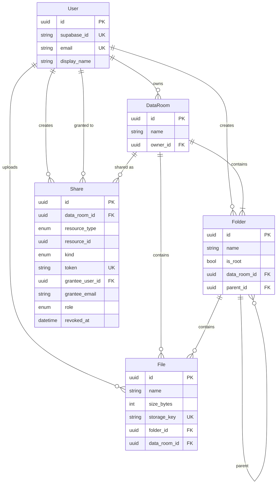

# Acme Data Room

Take-home MVP: folders, PDFs, and read-only sharing (named users or a public link).

- `apps/web` - React, TypeScript, Vite, Tailwind, shadcn/ui
- `apps/api` - NestJS, Prisma, PostgreSQL
- Auth and blobs: Supabase (Google login + Storage)

## Setup

Needs Node 20+, pnpm 9, Docker (or Postgres 16), and a [Supabase](https://supabase.com) project.

### 1. Supabase

1. New project.
2. Authentication > Providers > Google: turn Google on. Redirect URLs: `http://localhost:5173/**` and, after deploy, your frontend origin. The app lands on `/auth/callback`.
3. Authentication > URL configuration: site URL `http://localhost:5173` (production URL later).
4. Project Settings > API: Project URL, `anon` key, `service_role` key, JWT Secret.
5. Storage bucket `dataroom-files` (private). The API will create it on first upload if it is not there.

### 2. Install

```bash
pnpm install
cp apps/api/.env.example apps/api/.env
cp apps/web/.env.example apps/web/.env
```

Fill `SUPABASE_*` in `apps/api/.env` and `VITE_SUPABASE_*` in `apps/web/.env`. Leave `VITE_API_URL=http://localhost:3000/api`. Set `FRONTEND_URL` on the API to the web origin (CORS).

### 3. Database

```bash
docker compose up db -d
pnpm --filter api prisma:deploy
```

Host Postgres is on **5433** (see `DATABASE_URL` in `apps/api/.env`).

### 4. Demo seed (optional)

Log in once so your user row exists, then:

```bash
SEED_EMAIL=you@gmail.com pnpm --filter api prisma:seed
```

Script: `apps/api/prisma/seed.cjs`. It writes a small PDF into the bucket and a folder tree in your data room. Safe to re-run: if `Due Diligence` is already under root, it no-ops.

Tree:

- Due Diligence, Legal/Contracts, Legal/Corporate, Finance/Q1 statements, Finance/Archive, People
- A handful of named PDFs (CIM, NDA, cap table, etc.)
- 70 files in `Finance/Archive` (`Exhibit 01.pdf` ...) for scrolling the file list

Needs `DATABASE_URL`, `SUPABASE_URL`, and `SUPABASE_SERVICE_ROLE_KEY`.

### 5. Run

```bash
pnpm dev
```

- Web: http://localhost:5173
- API: http://localhost:3000/api/health

Full stack in Docker:

```bash
cp .env.example .env
# fill SUPABASE_* and VITE_SUPABASE_*
docker compose up --build
```

## Design

One data room per account. It is created on first API call, with a root folder. No room switcher.

Folders use `parent_id`. Deletes, delete preview, blob cleanup, and share inheritance use `WITH RECURSIVE` in Postgres.

PDFs go to Supabase Storage at `{dataRoomId}/{fileId}.pdf`. Postgres stores name, size, mime, and `storage_key`. Preview uses a short-lived signed URL.

File names are unique per folder. A second `Report.pdf` becomes `Report (1).pdf`. Rename/move collisions return 409. Folder names are unique among siblings. The root folder cannot be renamed or deleted.

A `shares` row is a grant on a data room, folder, or file. Nested content is included. Breadcrumbs stop at the shared node. Public links use a random `token`. User shares need an account. Recipients are viewers; only the owner writes.

Login is Google via Supabase. The API sends `Authorization: Bearer`. HS256 is verified with `SUPABASE_JWT_SECRET`; ES256 via Auth `/user`. On 401 after a failed refresh the client signs out.

API is Nest modules + Prisma (raw SQL where needed). Web is feature folders + TanStack Query.

Search: `ILIKE` on names, own room plus shares, max 15 hits.

Name conflicts are the extra-credit stand-in for versioning. There is no history of the same file.

## Data model



`resource_type`: `DATA_ROOM | FOLDER | FILE`. `kind`: `PUBLIC_LINK | USER`. `role`: `VIEWER | EDITOR` (MVP only uses viewer in the UI). Revoke sets `revoked_at`.

Indexes: `data_rooms.owner_id`; `folders(data_room_id, parent_id)`; `files(folder_id, data_room_id)` plus unique `(folder_id, name)`; `shares` on `data_room_id`, `(resource_type, resource_id)`, `grantee_user_id`, `grantee_email`, unique `token`.

## How it scales

### Folder size / item count (whole subtree)

Delete preview already counts descendants with a recursive CTE. Size is the same walk:

```sql
WITH RECURSIVE tree AS (
  SELECT id FROM folders WHERE id = $folderId
  UNION ALL
  SELECT f.id FROM folders f
  INNER JOIN tree t ON f.parent_id = t.id
)
SELECT
  COUNT(*)::bigint AS file_count,
  COALESCE(SUM(size_bytes), 0)::bigint AS total_bytes
FROM files
WHERE folder_id IN (SELECT id FROM tree);
```

Fine for a delete warning. If listings needed subtree size on every row, denormalize `file_count` / `total_bytes` on `folders` and update on upload/delete/move.

### ~100k files in one data room

File lists are paged. `GET /folders/:id/contents?cursor=&limit=50` (max 100) uses a name cursor, not `OFFSET`. The UI loads the next page on scroll. Child folders still come in one query. For a huge number of subfolders I would page those too, and virtualize the table if many rows stay mounted.

`(folder_id, name)` covers listing. Queries are per folder (or the ids from a share).

Search is `ILIKE` with a hit cap. At 100k files add `pg_trgm` (GIN on `name`), still scoped by room / share.

Folder delete collects `storage_key` with the same CTE, then removes objects.

### Editors later

`shares.role` is `VIEWER | EDITOR`. Public links stay viewer. Editors: write `EDITOR` on invite; in `AccessService` owner = full access, `EDITOR` = mutate in the shared subtree, `VIEWER` = read. Same table. A tighter grant on a child is another row.

## Using AI

I used Cursor to speed up implementation. My time went into the design: which stack to use, how the product should flow, and the UX.

## Hosted URLs

- Frontend: https://data-room-1.onrender.com
- API: https://data-room-cbmd.onrender.com
- API health: https://data-room-cbmd.onrender.com/api/health
