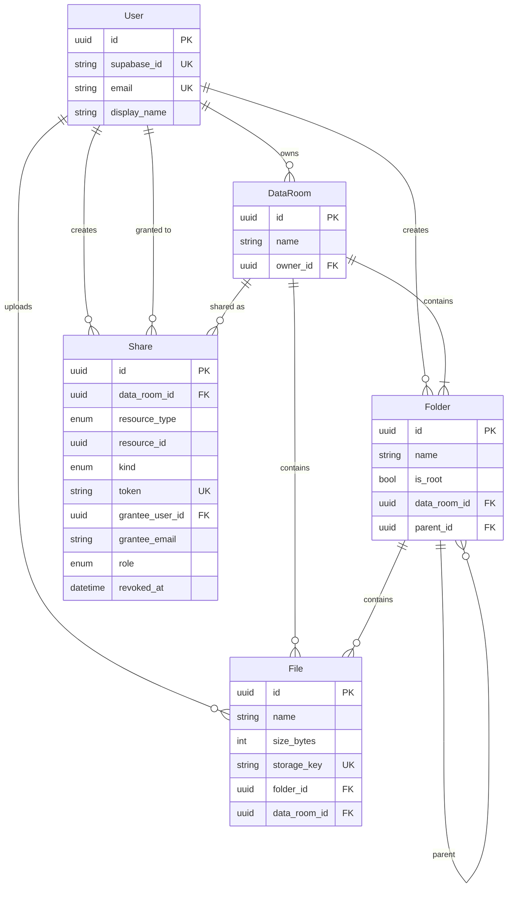

# Acme Data Room

Take-home MVP: folders, PDFs, and read-only sharing (named users or a public link).

- `apps/web` - React, TypeScript, Vite, Tailwind, shadcn/ui
- `apps/api` - NestJS, Prisma, PostgreSQL
- Auth and blobs: Supabase (Google login + Storage)

## Setup

Needs Node 20+, pnpm 9, Docker (or Postgres 16), and a [Supabase](https://supabase.com) project.

### 1. Supabase

1. New project.
2. Authentication > Providers > Google: turn Google on. Add the redirect URL from the dashboard (`http://localhost:5173` locally).
3. Authentication > URL configuration: site URL `http://localhost:5173`.
4. Project Settings > API: Project URL, `anon` key, `service_role` key, JWT Secret.
5. Storage bucket `dataroom-files` (private). The API will create it on first upload if it is not there.

### 2. Install

```bash
pnpm install
cp apps/api/.env.example apps/api/.env
cp apps/web/.env.example apps/web/.env
```

Fill `SUPABASE_*` in the API env and `VITE_SUPABASE_*` in the web env. Leave `VITE_API_URL=http://localhost:3000/api`.

### 3. Database

```bash
docker compose up db -d
pnpm --filter api prisma:deploy
```

Host Postgres is on **5433** (see `DATABASE_URL` in `apps/api/.env`).

### 4. Demo seed (optional)

Log in once so your user row exists, then:

```bash
SEED_EMAIL=you@gmail.com pnpm --filter api prisma:seed
```

Script: `apps/api/prisma/seed.cjs`. It writes a small PDF into the bucket and a folder tree in your data room. Safe to re-run: if `Due Diligence` is already under root, it no-ops.

Tree:

- Due Diligence, Legal/Contracts, Legal/Corporate, Finance/Q1 statements, Finance/Archive, People
- A handful of named PDFs (CIM, NDA, cap table, etc.)
- 70 files in `Finance/Archive` (`Exhibit 01.pdf` ...) for scrolling the file list

Needs `DATABASE_URL`, `SUPABASE_URL`, and `SUPABASE_SERVICE_ROLE_KEY`.

### 5. Run

```bash
pnpm dev
```

- Web: http://localhost:5173
- API: http://localhost:3000/api/health

Full stack in Docker:

```bash
cp .env.example .env
# fill SUPABASE_* and VITE_SUPABASE_*
docker compose up --build
```

## Design

One data room per account, created on first API call together with a root folder. I did not build a room picker.

Folders are an adjacency list (`parent_id`). Deletes, delete-previews, storage cleanup, and share inheritance walk the tree with `WITH RECURSIVE`. I did not bother with nested sets or a materialized path; writes stay simple and Postgres does the walk.

PDF bytes sit in Supabase Storage at `{dataRoomId}/{fileId}.pdf`. Postgres only has name, size, mime, `storage_key`. Preview is a short-lived signed URL so the bucket can stay private.

File names are unique per folder. Upload of a duplicate becomes `Report (1).pdf`. Rename/move that would collide just 409. Sibling folder names are unique in app code. The root folder cannot be renamed or deleted.

Sharing is a grant, not a copy. One `shares` row points at a data room, folder, or file. A folder/room grant includes everything underneath; breadcrumbs stop at the shared node so you cannot walk up. Public links use a random `token`. User shares need an account (otherwise send a link). Recipients are viewers. Only the owner writes.

Web: Google via Supabase, `Authorization: Bearer <access token>`. API verifies HS256 with `SUPABASE_JWT_SECRET` (Auth `/user` only if that secret is missing).

Nest modules match the domain. Repositories wrap Prisma / raw SQL. Web is feature folders + TanStack Query.

## Data model



`resource_type`: `DATA_ROOM | FOLDER | FILE`. `kind`: `PUBLIC_LINK | USER`. `role`: `VIEWER | EDITOR` (MVP only uses viewer in the UI). Revoke sets `revoked_at`.

Indexes: `data_rooms.owner_id`; `folders(data_room_id, parent_id)`; `files(folder_id, data_room_id)` plus unique `(folder_id, name)`; `shares` on `data_room_id`, `(resource_type, resource_id)`, `grantee_user_id`, `grantee_email`, unique `token`.

## How it scales

### Folder size / item count (whole subtree)

Delete preview already counts descendants with a recursive CTE. Size is the same walk:

```sql
WITH RECURSIVE tree AS (
  SELECT id FROM folders WHERE id = $folderId
  UNION ALL
  SELECT f.id FROM folders f
  INNER JOIN tree t ON f.parent_id = t.id
)
SELECT
  COUNT(*)::bigint AS file_count,
  COALESCE(SUM(size_bytes), 0)::bigint AS total_bytes
FROM files
WHERE folder_id IN (SELECT id FROM tree);
```

Fine for a confirm-delete dialog. If every row in a listing needed a subtree size, I would store `file_count` / `total_bytes` on `folders` and bump them on upload/delete/move. Walking the tree once per row would be a bad idea.

### ~100k files in one data room

File lists are paged. `GET /folders/:id/contents?cursor=&limit=50` (max 100) uses a name cursor, not `OFFSET`. The table loads the next page on scroll. Subfolders still come back in one query; if a directory had a huge number of child folders I would page those the same way. Past tens of thousands of *loaded* rows I would also virtualize the table.

`(folder_id, name)` is the listing index. Queries stay scoped to a folder (or the ids from a share), not “all files in the room”.

Search is `ILIKE` on `name` with a small hit cap. No trigram index; btree on `name` would not help `%foo%` anyway. At 100k I would add `pg_trgm` (GIN on `name`) or a real search index, still filtered by room / share.

Blobs do not care how many rows you have. Folder delete gathers `storage_key` with the same CTE, then deletes objects.

JWT is verified in-process. After the user exists we do not rewrite the row on every request.

### Editors later

`shares.role` is already `VIEWER | EDITOR`. Public links stay viewer. For editors: set `EDITOR` on invite, then in `AccessService` owner = full access, `EDITOR` = mutate inside the shared subtree, `VIEWER` = read. Same table. Extra grants on a child folder are just more rows.

## Using AI

I used Cursor to write the modules and to move faster.

## Hosted URLs

- Frontend:
- API health:
